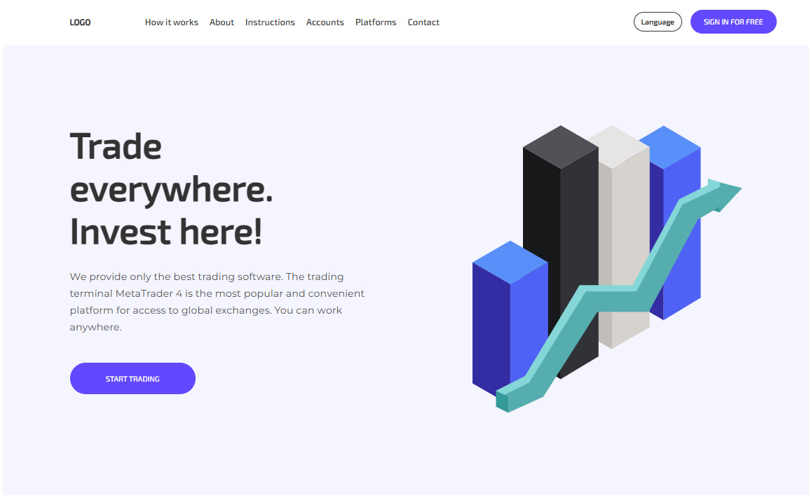

# Trading company landing page

**Live Demo:** [https://oyakovytskyi.github.io/](https://oyakovytskyi.github.io/)

Адаптивний лендинг, реалізований за макетом з Figma з використанням SCSS та JavaScript. Проєкт включає інтерактивні елементи, адаптивну верстку та дотримання дизайну.

---





## 📂 Структура проєкту

```bash
assets/ # Зображення, іконки
src/
scss/ # SCSS файли
utils/ # Міксіни, змінні, загальні стилі
js/
burger-menu.js
faq.js
form-validation.js
language.js
scroll.js
testimonials.js
index.html
script.js
```

---

## ✨ Функціонал

- **Бургер-меню** для мобільної версії  
- **FAQ секція** з аккордеон ефектом  
- **Валідатор форми**  
- **Мовний перемикач**  
- **Гладкий скролл** по секціях  
- **Секція відгуків** з інтерактивним каруселем  

---

## 🎨 Технології

- HTML5  
- SCSS (застосування змінних, міксінів, nesting)  
- JavaScript (ES6+)  
- GitHub Pages для деплою  

---

## 📱 Адаптивність

- Мобільна, планшетна та десктоп версії  
- Використання медіа-запитів і гнучких одиниць виміру  

---

## 🖼️ Прев’ю

Якщо є скріншот сайту, додай сюди:


⚡ Як запустити локально
Клонувати репозиторій:

git clone https://github.com/oyakovytskyi/apple.git
Відкрити index.html у браузері
